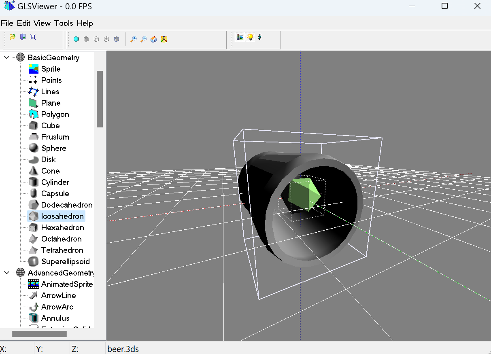
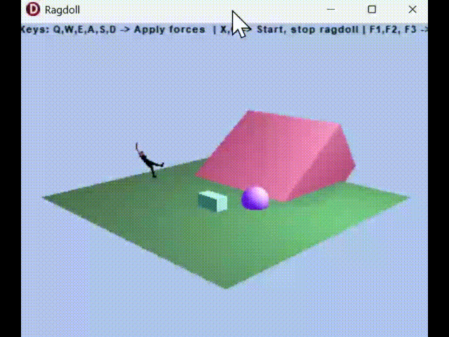
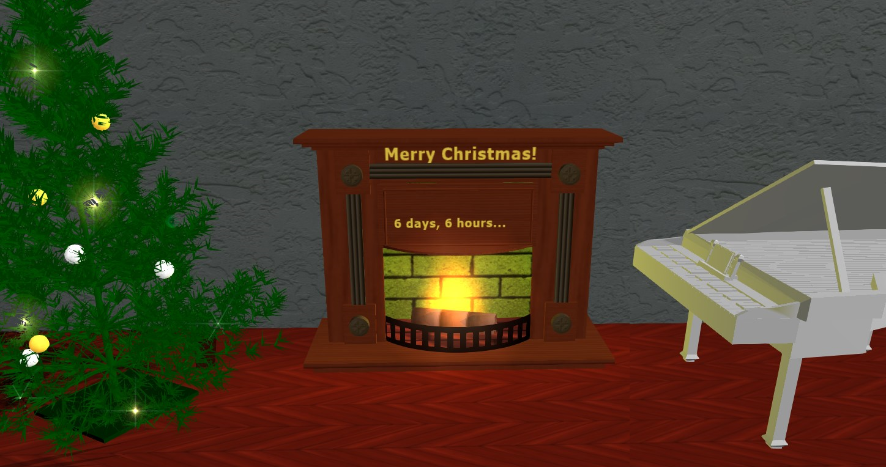
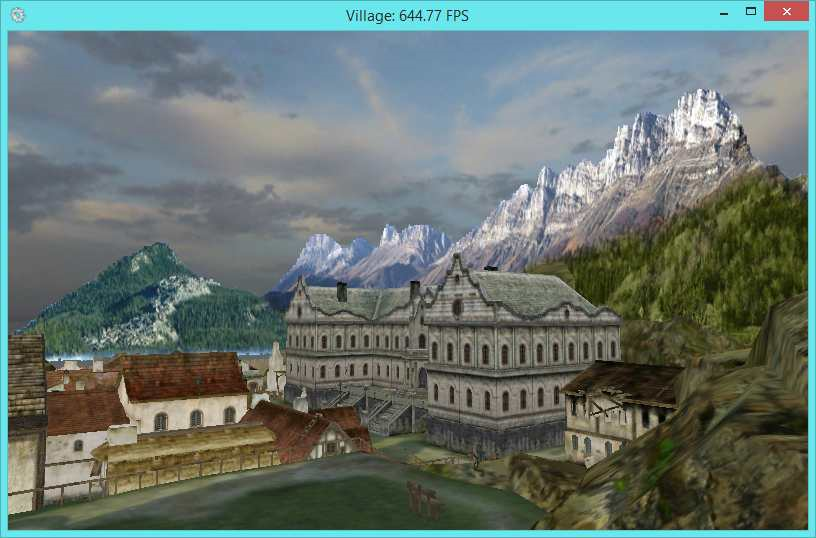
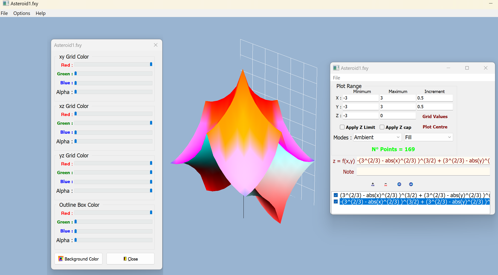

# LZXEngine
The graphics engine of 3D scenes with LCL component packages for Delphi and Free Pascal.
Class libraries with rendering and animations of spatial objects 
include managers for supporting physics, sounds, terrains with materials and shaders. 
### How to install
1. Download a zip archive of the last release or clone the repository
2. Run _setupDLL_admin.cmd to support external DLLs libraries
3. Configure the IDE settings and paths to all sources
4. Open group projects dpk for Delphi or lpk for Lazarus, compile and install components
5. Run demos in Examples  

Some examples: 
GLS Viewer

Clothify 

Christmas

Village

Plot2D

LZXE Team
